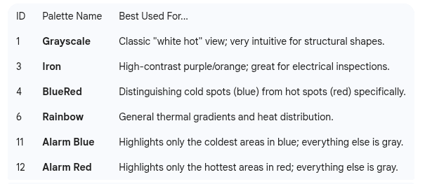

# Usage:

# Baumer Cavitar weldpool camera

# Optris thermal camera

* ROS2 driver
https://github.com/Optris/optris_drivers2 

* Documentation
https://sdk.optris.com/libirimager2/html/index.html 

# BenQ Ideacam S1 webcam
# ls /dev/video*
# ros2 run v4l2_camera v4l2_camera_node --ros-args -p video_device:=/dev/video0
# v4l2-ctl --list-devices

# Umik microphone

arecord -l

# Look for a line like card 1: U0dB [Umik-1 Gain: 0dB], device 0: USB Audio
# Important: Note the card number and device number (e.g., card 1, device 0 becomes hw:1,0).

ros2 run audio_common audio_capturer_node --ros-args -p device_name:="plughw:2,0" -p channels:=2 -p rate:=48000 -p format:=16
ros2 run audio_capture audio_capture_node --ros-args -p device_name:="plughw:3,0" -p channels:=2 -p rate:=48000

# device: Set this to the card number from arecord -l.

# rate: The UMIK-1 is locked at 48000 Hz. The UMIK-2 supports up to 192000 Hz, but 48000 is standard for ROS 2.

# format: 8 typically corresponds to paInt16.

# ros2 topic echo /audio

# ros2 run audio_common audio_player_node